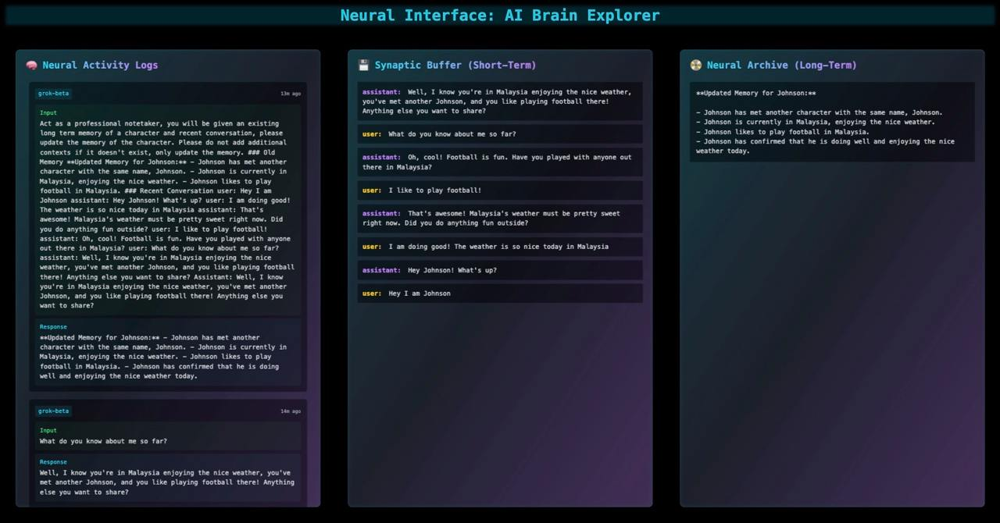
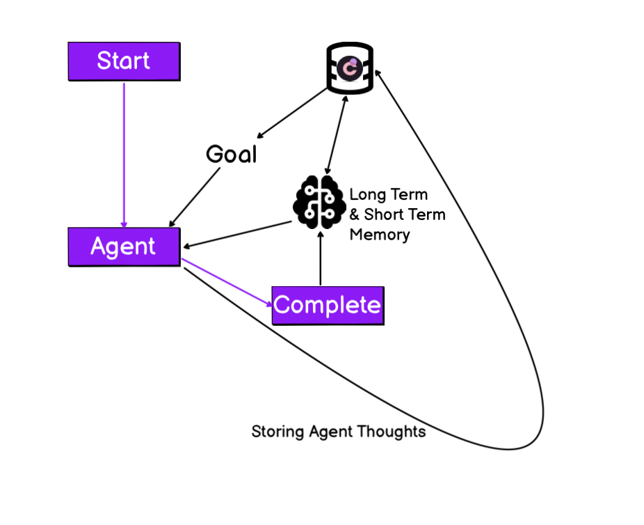
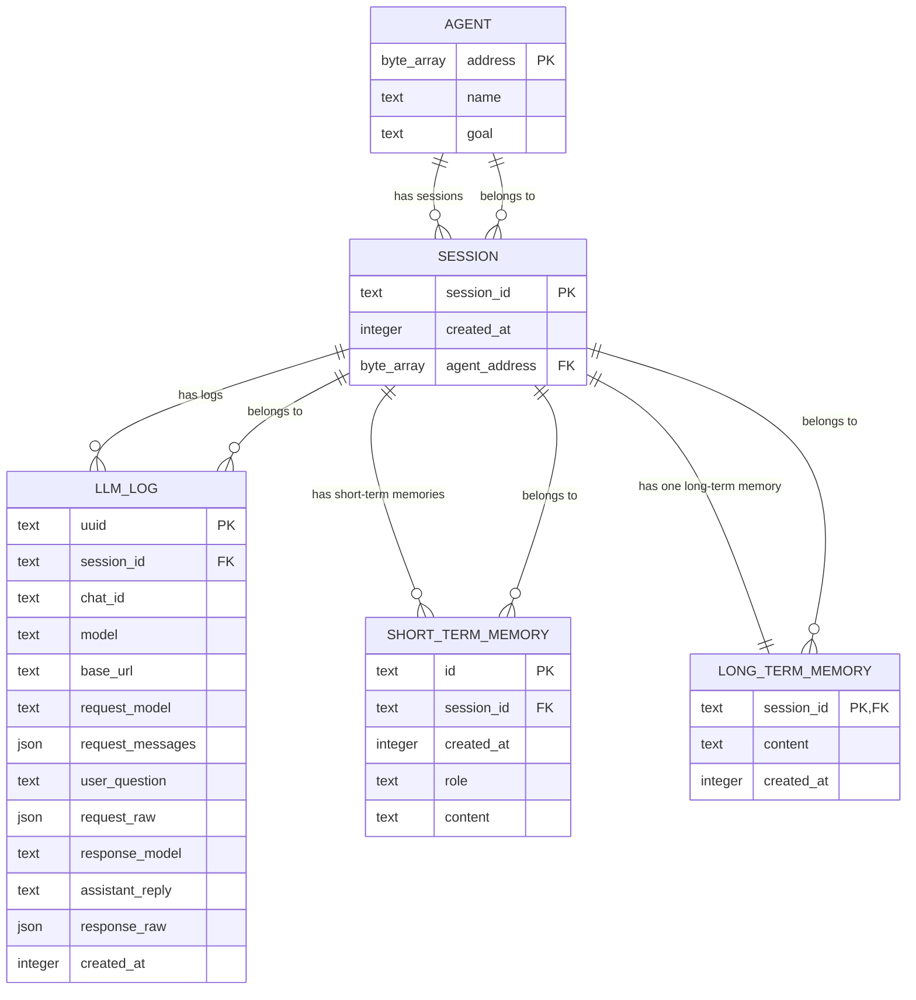

# Chromia Neural Interface

This repository demonstrates using Chromia to store AI Agent short-term and long-term memories on chain. It also demonstrates a simple neural interface for interacting with the AI Agent.




## Roadmap

### Current Features
- ✅ Short-term and long-term memory storage
- ✅ Neural activity logging
- ✅ Real-time memory updates
- ✅ Interactive neural interface

### Upcoming Features
- 🧠 AI Agent Personalities
  - Customizable personality traits for each AI Agent
  - Language preferences
  - AI Agent access to external tools / APIs to execute tasks autonomously 




## How it works (Mermaid Diagram)



## How to Run

### Prerequisites
- Install [Docker]([https://bun.sh/](https://docs.docker.com/engine/install/ubuntu/))

### Steps
1. Install dependencies and setup
   ```sh
   bash build
   ```
   Update `XAI_API_KEY` in `.env`.

2. Start bun dev server
   ```sh
   bash start.sh
   ```
