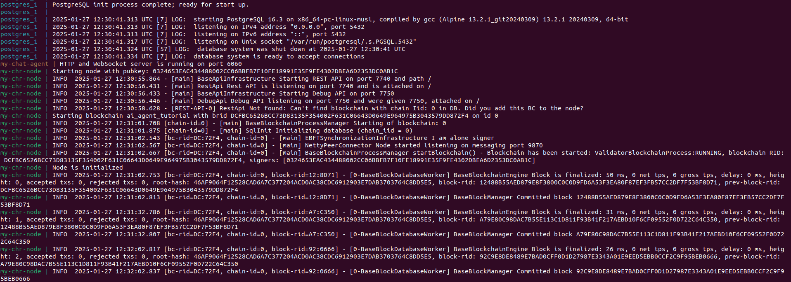

# Chromia Neural Interface

This repository demonstrates using Chromia to store AI Agent short-term and long-term memories on chain. It also demonstrates a simple neural interface for interacting with the AI Agent.

[Chromia Demo using oyster](https://www.youtube.com/watch?v=YfWzTeK1LaY)


## Prerequisites
- Install [Docker](https://docs.docker.com/engine/install/ubuntu/)
- Enable [host networking](https://docs.docker.com/engine/network/drivers/host/#docker-desktop) on docker desktop
- Fetch [Groq API key](https://console.groq.com/keys)
  
## Steps for local run

**Note:** Update the following docker images according to your system's architecture in the `docker-compose.yml`:
  ```sh
    # Chromia node service
    chr-node:
      image: kalpita888/chromia-node:1.0.0            # For arm64 system use kalpita888/chromia-node_arm64:1.0.0 and for amd64 system use kalpita888/chromia-node:1.0.0
  ```
  ```sh
   # Bun service
    bun:
      image: kalpita888/bun:1.0.0                     # For arm64 system use kalpita888/bun_arm64:1.0.0 and for amd64 system use kalpita888/bun:1.0.0
  ```
  

1. Install dependencies and setup
   ```sh
   docker-compose up --build
   ```
   Update `XAI_API_KEY` in `.env`

2. Wait for the chromia node to start. You should be able to see logs:
   

3. Navigate to http://localhost:6060 and start chatting!

## Steps for using Marlin's TEE (only supports Linux system)
1. Replace the environment variable value with the `XAI_API_KEY` in `docker-compose.yml`
   ```sh
   environment:
      - XAI_API_KEY=gsk_****
   ```

2. [Check your system requirements](https://docs.marlin.org/oyster/build-cvm/tutorials/)

3. [Setup the development environment](https://docs.marlin.org/oyster/build-cvm/tutorials/setup)

4. Build an enclave image
   ```sh
   # for amd64
   oyster-cvm build --platform amd64 --docker-compose ./docker-compose.yml

   # for arm64
   oyster-cvm build --platform arm64 --docker-compose ./docker-compose.yml
   ```
   You should now have a result folder with the enclave image in image.eif and the PCRs in pcr.json. The PCRs represent a "fingerprint" of the enclave image and will help you verify what is running in a given enclave.

5. Obtain an [API key and secret from Pinata](https://docs.pinata.cloud/account-management/api-keys)

6. Upload your enclave image to Pinata
   ```sh
   # Note the image URL after it finishes
   PINATA_API_KEY=<API key> PINATA_API_SECRET=<API secret> oyster-cvm upload --file result/image.eif
   ```
   Make a note of the image URL from the output.

7. Set up a wallet where you can export the private key. Deposit 0.001 ETH and 1 USDC to the wallet on the Arbitrum One network.

8. Deploy the enclave image 
   ```sh
   # for amd64
   # replace <key> with private key of the wallet
   # replace <url> with url from the upload step
   oyster-cvm deploy --wallet-private-key <key> --image-url <url> --instance-type c6a.4xlarge --region ap-south-1 --operator 0xe10Fa12f580e660Ecd593Ea4119ceBC90509D642 --duration-in-minutes 15

   # for arm64
   # replace <key> with private key of the wallet
   # replace <url> with url from the upload step
   oyster-cvm deploy --wallet-private-key <key> --image-url <url> --instance-type c6g.4xlarge --region ap-south-1 --operator 0xe10Fa12f580e660Ecd593Ea4119ceBC90509D642 --duration-in-minutes 15
   ```
   Make a note of the IP from the output and navigate to http://IP:6060 and start chatting!

9. Verify a remote attestation (recommended)
   ```sh
   # Replace <ip> with the IP you obtained above
   # Replace <pcrs> with values from pcr.json
   oyster-cvm verify --enclave-ip <ip> -0 <pcr0> -1 <pcr1> -2 <pcr2>
   ```
   You should see `Verification successful` along with some attestation fields printed out.

10. Head over to [Oyster Confidential VM tutorials](https://docs.marlin.org/oyster/build-cvm/tutorials/) for more details.
